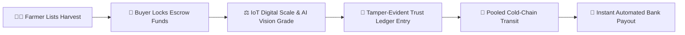

# 🌾 KrishiConnect — Transparent Digital Agricultural Supply Platform

[](https://sih.gov.in)
[](https://sih.gov.in)
[](https://react.dev)
[](https://vitejs.dev)
[](LICENSE)
[](https://vercel.com)

> **Empowering Indian Smallholder Farmers via Direct Institutional Discovery, Cryptographic Trust Ledgers, Digital Escrow Settlements, and IoT/AI-Assisted Quality Verification.**

---

## 📌 Problem Context & Motivation (SIH26033)

India's traditional agricultural supply chain is weighed down by fragmented layers: **Village Aggregators ➔ Commission Agents (Kachha Arhtiya) ➔ Mandi Traders (Pakka Arhtiya) ➔ Wholesalers ➔ Retailers**. This opaque multi-tiered intermediary chain results in:

- **30%–45% Value Loss:** Middlemen capture excessive spreads, leaving smallholder farmers with low net realization.
- **Weighment Manipulation & Scale Rigging:** Manual scales and unregulated checkposts shave 3–8% off recorded crop volumes.
- **Payment Insecurity & Counterparty Defaults:** Delayed payouts often take weeks or months, trapping farmers in high-interest debt cycles.
- **Arbitrary Quality Deduction:** Subjective grading by buyers at unloading docks creates arbitrary price haircuts without recourse.

**KrishiConnect** completely reimagines farm-to-enterprise commerce by providing an end-to-end transparent digital supply infrastructure connecting verified producers directly with institutional procurement teams, bulk buyers, and FPOs.

---

## 🚀 Key Innovations & Platform Features

### 👨‍🌾 1. Farmer Kisan Terminal
- **Direct Marketplace Listing:** Fast crop onboarding with reserve prices, harvest dates, and location tags.
- **Live Mandi Price Pulse:** Real-time benchmark comparisons against local APMC mandis showing positive price realization delta (+20% to +30%).
- **Multilingual & Audio Accessibility:** Native interface translations for **English**, **Hindi (हिन्दी)**, and **Bangla (বাংলা)** with one-click voice narration support for rural usability.
- **Guaranteed Digital Escrow:** Payouts are locked in digital escrow before harvest dispatch, eliminating payment default risk.
- **Real-time Order & Delivery Tracking:** Transparent status indicators across the harvest lifecycle (`Listed` ➔ `Offered` ➔ `Weighed` ➔ `Dispatched` ➔ `Paid`).

### 🏢 2. Institutional Buyer Terminal
- **Wholesale Spot Discovery:** Filter verified lots by crop, grade (Grade A/B/C), distance, moisture content, and seller type (Individual Farmer or FPO).
- **Escrow-Secured Contracts:** Lock 100% contract value upfront in escrow with instant receipt and contract formation.
- **Quality & Weight Attestation:** Access verifiable weight logs, grade inspection certificates, and downloadable digital audit summaries (via `html2canvas`).
- **Fleet & Route Telemetry:** Real-time geofenced transport monitoring, delivery ETAs, and multi-stop pooled freight aggregation.

### 🛡️ 3. Tamper-Evident Trust Ledger & Dispute Resolution
- **Immutable Audit Trail:** Cryptographically sequential state logs tracking every key transaction lifecycle event (listing creation, buyer acceptance, digital weighment, quality audit, escrow lock, bank disbursement).
- **Automated Trust Monitor:** Real-time anomaly detection engine tracking price deviations, scale discrepancies, and suspicious buyer/seller patterns.
- **Objective Dispute Resolution:** Integrated case management module with multi-party evidence logs, tamper checks, and transparent administrative oversight.

### 🚚 4. Shared Logistics & Freight Pooling
- **Smallholder Route Aggregation:** Pools harvest lots across proximate villages along a single cold-freight transit corridor, reducing smallholder freight costs by up to **40%**.

---

## 🔄 End-to-End Operational Workflow



1. **Direct Discovery & Contract Formation:** Farmer posts harvest specs and reserve price; buyer accepts and locks 100% of purchase capital in escrow.
2. **Hardware-Assisted Attestation:** IoT load cells capture exact gross/tare weights; computer vision models evaluate produce grade (Grade A/B/C) at rural collection hubs.
3. **Cryptographic Ledger Sealing:** All transaction metadata (weight, moisture, grade, price) is recorded onto the immutable Trust Ledger.
4. **Optimized Pooled Transit:** Route optimizer clusters farm pickup points for shared vehicle transit.
5. **Instant Financial Settlement:** On digital delivery verification at the destination terminal, escrow releases payments straight into the farmer's bank account via instant UPI/NEFT.

---

## 🛠️ Technology Stack

| Layer | Implementation in Working Prototype | Production & Hardware Roadmap |
| :--- | :--- | :--- |
| **Frontend Framework** | **React 19**, **Vite 8**, **React Router v7** | PWA (Offline-first caching via Service Workers) |
| **Styling & Design System** | Glassmorphic CSS3 design tokens, DM Sans, IBM Plex Mono, Inter | Tailwind CSS / Design System UI library |
| **Animation & Visuals** | **GSAP**, **Framer Motion**, **Three.js** (WebGL GLSL Fluid Background) | Leaflet / Mapbox GL live transit GPS integration |
| **State & Localization** | React Context (`KrishiContext`, `LanguageContext`), Multi-language engine (`en`, `hi`, `bn`) | Zustand / Redux Toolkit, i18next |
| **Document Export** | **html2canvas** (Audit-ready transaction & weight certificates) | PDFKit / Puppeteer server-side attestation |
| **Edge Hardware (Roadmap)** | Telemetry simulator & sensor mock engine | **ESP32 + HX711 Load Cells** (GSM/MQTT scale), **OpenCV/PyTorch** (AI Vision Crop Grader) |
| **Settlement & Trust (Roadmap)** | Client-side cryptographic state ledger | **Hyperledger Fabric / Polygon Smart Contracts**, UPI AutoPay / e-RUPI |
| **Hosting & CI/CD** | **Vercel Edge Network** (`vercel.json`), GitHub Actions | Docker, Kubernetes, Nginx |

---

## 📂 Codebase Architecture

```
KrishiConnect/
├── public/                 # Static assets, SVG icons & brand artwork
├── src/
│   ├── assets/             # Vector icons, imagery, and static resources
│   ├── components/
│   │   ├── common/         # Buttons, badges, modals, status indicators
│   │   ├── dashboard/      # Mandi ticker, metric tiles, quick action cards
│   │   ├── effects/        # LiquidGlass & WebGL fluid shader shaders
│   │   ├── layout/         # AppLayout shell, navigation bar, footer
│   │   └── ui/             # RollingText, FluidFieldBackground animations
│   ├── context/
│   │   ├── KrishiContext.jsx   # Global marketplace state, listings, and orders
│   │   └── LanguageContext.jsx # Tri-lingual translation dictionary (EN, HI, BN)
│   ├── data/
│   │   └── mockData.js     # APMC market rates, ledger logs, logistics routes, test profiles
│   ├── pages/
│   │   ├── Landing.jsx          # Conversion-focused landing & problem statement overview
│   │   ├── farmer/              # Farmer portal (Dashboard, ListProduce, Orders, Ledger, Logistics, Payments)
│   │   ├── buyer/               # Buyer portal (WholesaleMarket, BuyerOrders, BuyerDashboard)
│   │   └── admin/               # Admin portal (AdminDashboard, Dispute, TrustMonitor)
│   ├── styles/                  # Global CSS variables, reset, typography & themes
│   ├── App.jsx                  # Application routing table & provider composition
│   └── main.jsx                 # Vite client entry point
├── index.html              # HTML5 template with optimized typography links
├── package.json            # NPM dependencies and run scripts
├── vercel.json             # Single Page Application (SPA) rewrite rules
└── vite.config.js          # Vite build configuration
```

---

## ⚡ Getting Started

### Prerequisites
- **Node.js**: v18.0.0 or higher
- **npm**: v9.0.0 or higher

### 1. Clone the Repository
```bash
git clone https://github.com/your-username/KrishiConnect.git
cd KrishiConnect
```

### 2. Install Dependencies
```bash
npm install
```

### 3. Start Development Server
```bash
npm run dev
```
Open [http://localhost:5173](http://localhost:5173) in your browser.

### 4. Build for Production
```bash
npm run build
```
Production assets will be output to the `/dist` directory.

### 5. Code Quality & Linting
```bash
npm run lint
```

---

## 🌐 Routes & Role Portals

| Route | Role | Description |
| :--- | :--- | :--- |
| `/` | **Public** | Interactive Landing Page, Problem/Solution pitch, role selector |
| `/farmer/login` | **Farmer** | Farmer authentication & hub onboarding |
| `/dashboard` | **Farmer** | Kisan Dashboard, live mandi comparison, active lots, escrow balance |
| `/list-produce` | **Farmer** | Harvest listing form with price guidance & quality specs |
| `/market` | **Farmer** | District-level mandi price pulse & buyer demand trends |
| `/orders` | **Farmer** | Contract lifecycle, buyer bids, dispatch triggers |
| `/logistics` | **Farmer / Buyer** | Fleet telematics, pooled transit corridors, route waypoints |
| `/ledger` | **Farmer / Buyer** | Tamper-evident cryptographic transaction ledger |
| `/payments` | **Farmer** | Escrow payment status, bank account management, payout history |
| `/buyer` | **Buyer** | Institutional buyer procurement dashboard & demand analytics |
| `/buyer/marketplace` | **Buyer** | Live wholesale marketplace, bulk lot filtering, escrow lock checkout |
| `/buyer/orders` | **Buyer** | Procurement contract tracking & receiving confirmation |
| `/admin` | **Admin** | System health, aggregate GMV, anomaly monitoring, dispute resolution |
| `/admin/trust-monitor`| **Admin** | Automated fraud detection (price/weight discrepancy alerts) |
| `/admin/dispute` | **Admin** | Case-by-case dispute mediation with evidentiary ledger records |

---

## 🏆 Hackathon Impact & Feasibility

- **30%+ Realization Gains:** Eliminates cascading commission cuts by providing zero-middleman institutional access.
- **Zero Weighment Fraud:** Cryptographically bound IoT scale telemetry eliminates discrepancies at local collection centers.
- **40% Lower Transit Costs:** Aggregated route pooling solves the high-cost smallholder logistics bottleneck.
- **Financial Inclusion:** Eliminates informal credit dependency through guaranteed digital escrow settlements within minutes of confirmed delivery.

---

## 📄 License

This project is developed under the **MIT License**. See the [LICENSE](LICENSE) file for more information.
